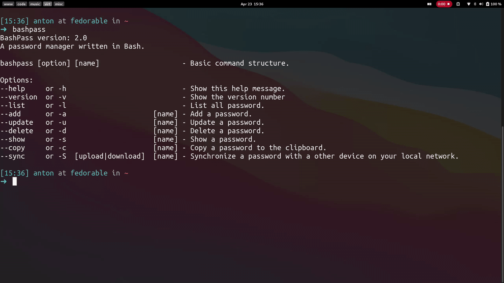

   <h1>
      BashPass
   </h1>
   

      A command-line based password manager written in Bash.
       
      <a href="https://github.com/AntonVanAssche/BashPass/wiki"><strong>Explore the docs »</strong></a>
       
       
      <strong>·</strong>
      <a href="https://github.com/AntonVanAssche/BashPass/issues">Report Bug</a>
      <strong>·</strong>
      <a href="https://github.com/AntonVanAssche/BashPass/issues">Request Feature</a>
   

   

      
      
      
      
      
      

## About BashPass

BashPass is a command-line based password manager written in Bash. It uses GPG to encrypt/decrypt the files where the passwords are stored . This means the passwords are 100% stored locally, so you don't have to trust a third party to store your passwords.

## Some Features

-  Add/edit/delete passwords
-  Generate passwords
-  Clipboard support
-  Safely copy passwords between different devices

## Documentation

-  **[Getting started](https://github.com/AntonVanAssche/BashPass/wiki/Getting-Started)**
-  **[Usage](https://github.com/AntonVanAssche/BashPass/wiki/Usage)**
-  **[Configuring](https://github.com/AntonVanAssche/BashPass/wiki/Configuring)**

## Contributing

Contributions are what make the open source community such an amazing place to learn, inspire, and create. Any contributions you make are **greatly appreciated**.

If you have a suggestion that would make this better, please fork the repo and create a pull request. You can also simply open an issue with the tag `enhancement`.
Don't forget to give the project a star! Thanks again!

1. Fork the Project
2. Create your Feature Branch (`git checkout -b feature/AmazingFeature`)
3. Commit your Changes (`git commit -m 'Add some AmazingFeature'`)
4. Push to the Branch (`git push origin feature/AmazingFeature`)
5. Open a Pull Request

See [`CONTRIBUTING.md`](./CONTRIBUTING.md) for more information.

## Feedback

This project isn't perfect, therefore suggestions/improvements are always [welcome](https://github.com/AntonVanAssche/BashPass/issues)!

## License

Distributed under the MIT License. See [`LICENSE.md`](./LICENSE.md) for more information.
